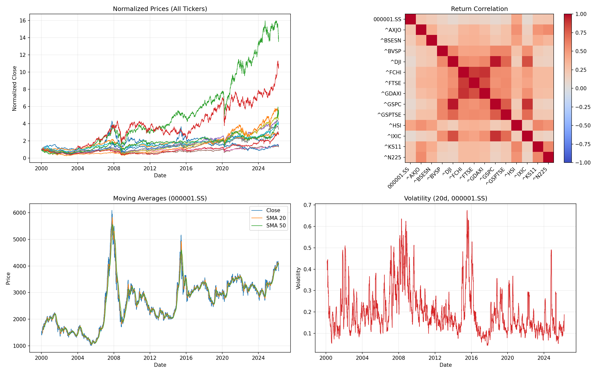
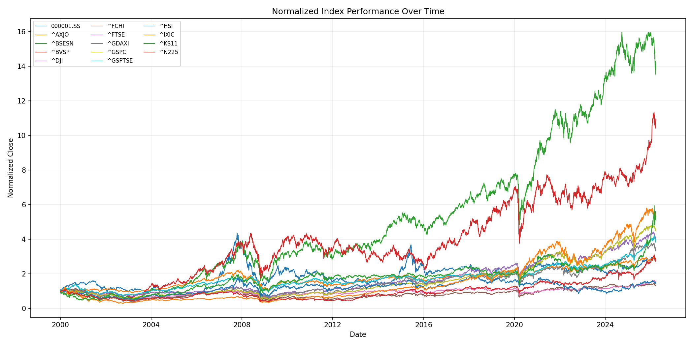
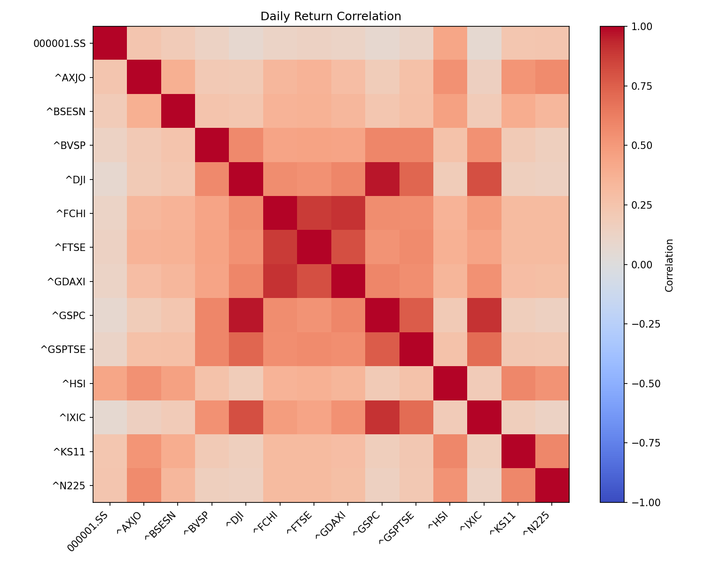
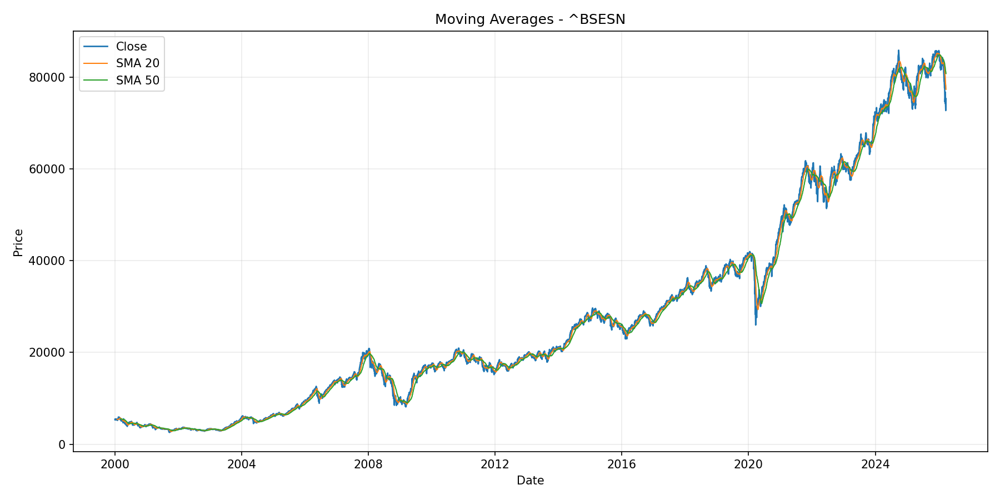
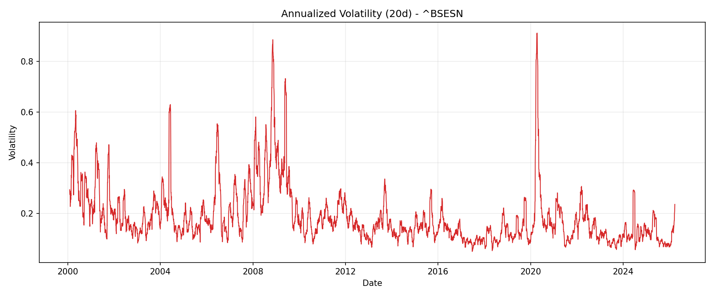
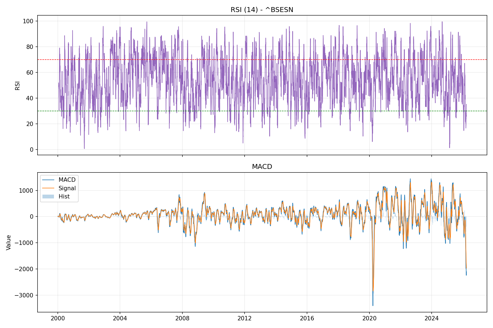

# Overview

I built this project to strengthen my practical software engineering skills in data processing, analytics, and visualization by creating a reproducible stock market analysis workflow. The goal was to design software that goes beyond one-off notebook analysis by adding a clear project structure, command-line execution, and test coverage.

The dataset analyzed is a historical global stock market index dataset stored in this repository at .sixth/Global_Stock_Market_Indices_2000_2026.csv. It contains daily OHLCV records and index metadata across major markets (2000 to 2026). The data format follows common Yahoo Finance-style historical index fields, and related source/reference pages are:
- https://finance.yahoo.com
- https://ranaroussi.github.io/yfinance/

My purpose for writing this software was to learn how to transform raw financial time-series data into actionable insights through a full pipeline: data cleaning, feature engineering (returns, moving averages, volatility, RSI, MACD), comparative analysis, and visual reporting.

[Software Demo Video](https://youtu.be/Mrqvzl7RJHQ)

# Data Analysis Results

- Question: How many indices and what time range does the dataset cover?
	Answer: 14 global indices from 2000-01-03 to 2026-03-25.

- Question: Which indices had the strongest long-term cumulative performance in this analysis?
	Answer: Top 3 by latest cumulative return were ^BSESN (13.0041), ^BVSP (9.9524), and ^KS11 (4.3277).

- Question: What core statistical outputs were generated?
	Answer: Cleaned dataset, quality report, engineered feature dataset, summary statistics table, and correlation matrix.

- Question: What visual outputs were produced?
	Answer: Combined dashboard, normalized performance chart, correlation heatmap, and ticker-level moving average, volatility, and RSI/MACD charts.

# Requirements Met

- Data collection and processing: The application loads the CSV dataset, converts dates and numeric columns, removes invalid rows, drops duplicates, and sorts records by ticker and date.
- Data analysis: The software calculates daily returns, cumulative returns, moving averages, volatility, RSI, MACD, summary statistics, and return correlations.
- Data visualization: The project generates a combined dashboard, normalized price chart, correlation heatmap, moving-average plots, volatility plots, and RSI/MACD plots.
- Programming skills: The project uses Python with Pandas, NumPy, Matplotlib, Seaborn, and Pytest to build a reusable and testable analysis workflow.
- Filter operation: The code filters rows by ticker when generating ticker-specific charts and when summarizing selected subsets.
- Sort operation: Cleaned data is sorted by ticker and date before analysis.
- Aggregate operation: The project uses count, min, max, mean, standard deviation, and grouped summary calculations to compare indices.
- Data conversion: The project converts Date values with `to_datetime` and OHLCV fields with `to_numeric` before analysis.

# Outcome Pictures

## Combined Dashboard

This dashboard provides a single-page summary of long-term performance, cross-index relationship patterns, and trend/risk behavior.

## Normalized Price Performance

This chart compares all indices on the same starting scale, making long-run growth differences easy to see.

## Correlation Heatmap

This heatmap shows how similarly index returns move together, helping identify diversification opportunities.

## Example Ticker Visuals (BSESN)

The moving-average chart highlights short-term and long-term trend direction for BSESN.

The volatility chart tracks periods of higher and lower market risk over time.

The RSI and MACD chart provides momentum and trend-strength signals often used in technical analysis.

# Development Environment

Tools used to develop this software:
- Visual Studio Code
- Git and GitHub
- Python virtual environment (venv)
- Command-line execution via PowerShell

Programming language and libraries:
- Python
- Pandas for data manipulation
- NumPy for numeric computation
- Matplotlib (and Seaborn in notebook workflow) for visualization
- Pytest for automated tests

# Useful Websites

* [Yahoo Finance](https://finance.yahoo.com)
* [yfinance Documentation](https://ranaroussi.github.io/yfinance/)
* [Pandas Documentation](https://pandas.pydata.org/docs/)
* [NumPy Documentation](https://numpy.org/doc/)
* [Matplotlib Documentation](https://matplotlib.org/stable/users/index)
* [Pytest Documentation](https://docs.pytest.org/)

# Future Work

* Add date-range and region filters directly in CLI commands.
* Add risk-focused metrics such as max drawdown and rolling Sharpe ratio.
* Extend visual reporting with sector-style grouping and period-by-period comparison views.
